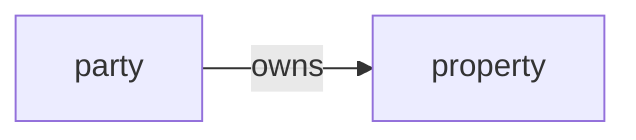

## Atomic Structure

A **fact** = two noun terms connected by one verb term. Example in Mermaid: 



## Advanced Structures


1. **Roles**: Noun terms play roles relative to verb terms.
    
    ```mermaid
    graph LR
    A[party] -.- C@{ shape: brace-r, label: "applicant" } -->|completes| B[load application]
    ```
    
2. **Classification** (is-a / instance-of): Shows examples of a category.
    
    ```mermaid
    graph LR
    A[scientist] -->|is-a| B[Issac Newton]
    ```
    
3. **Multi-level Categorization**: Hierarchical groupings.
    
    ```mermaid
    graph TD
    A[organization] ==> B[corporation]
    B ==> C[limited liability corporation]
    ```
    
4. **Unary Verbs**: Single noun term with property/state.
    
    ```mermaid
    graph LR
    A[product] --> B([is being actively marketed])
    ```
    
5. **N-ary Verbs**: Connect 3+ noun terms.
    
    ```mermaid
    graph LR
    
    A[sales agent] --- N([engineer briefs sales agent about product])
    B[engineer] --- N
    C[product] --- N

    ```
    
6. **Verb Objectification**: Verb becomes noun term.
    
    ```mermaid
    graph LR
    A[person] -->|owns| B{{ownership}}
    B --> D[vehicle]
    ```
    
7. **N-ary Objectification**: Objectified n-ary relationships.
    
    ```mermaid
    graph LR
    A[sales agent] --> N{{briefing}}
    B[engineer] --> N
    C[product] --> N
    ```
    

## Key Principles

- Noun terms may appear in multiple facts
- Verb terms should be specific and directional
- Objectified verbs become reusable noun terms in other facts